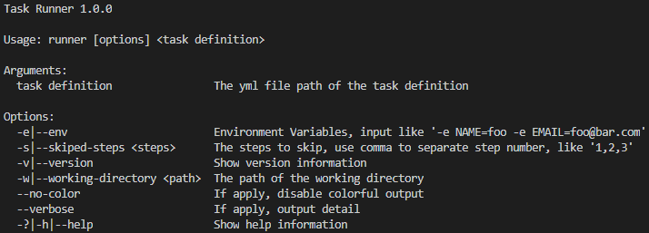
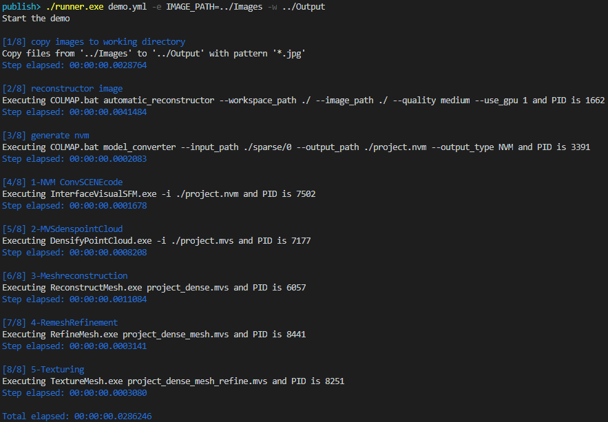

# SWARM Task Runner
A cross-platform and extendable task-execution CLI.

The features are:
- Cross-platform: it can be executed on Windows, MacOs, and any Linux distro.
- No dependency: the release packages includes all the libraries it needs to execute.
- Extendable: it can be extended by add other modules.
- Human Readable: the tasks are defined in yaml format.

## Install
[Download the right release](https://github.com/swarmnyc/Swarm.TaskRunner/releases) for your needs.

> NOTE: we will publish the github registry once we get accepted.

## Usage
Run `runner --help` to see the usage.


### Example


## Definition File
The definition is written by yaml

### Elements
- **version**: requested string, currently only "1.0.0"
- **label**: optional string, it presents on log
- **modules**: optional object
    - **module-name**: dotnet class full name like "copy: Swarm.TaskRunner.Steps.CopyModule" or "copy: Swarm.TaskRunner.Steps.CopyModule, Swarm.TaskRunner" the assembly name can be 
- **required-envs**: optional string array, like "- ENV_NAME"
- **optional-envs**: optional object array
    - -**name**: the name of env
    - &nbsp;**defaultValue**: default value
- **steps**: optional module array
- **onError** optional module array

### Modules
Module are extendable by inheriting `Swarm.TaskRunner.Modules.Module` and implementing two functions `Parse` and `Execute`. Then put the dll on the same folder. To use the module, put the type full name in `modules` element.

Each module has two common elements
- **module**: requested string, the system use this string as module name to found the module in modules
- **label**: optional string, it presents on log

These are current supported modules:
1. Copy Module: copy files in the source folder to another folder 
    - Type Full Name: `Swarm.TaskRunner.Modules.CopyModule`  
    - Elements:
        - **source**: requested string, the source folder, support env
        - **target**: requested string, the target folder, support env
        - **pattern**: optional string, the pattern to copy, support env

2. Command Module: execute a command
    - Type Full Name: `Swarm.TaskRunner.Modules.CommandModule`
    - Elements:
        - **file**: requested string, the path to the executable file, support env
        - **pwd**: optional string, the path of the working directory, support env, if this value is not provided, the runner will use the path of `--working-directory` or the current working directory.
        - **args**: optional string array or one string, support env

3. Echo Module: show a message
    - Type Full Name: `Swarm.TaskRunner.Modules.CommandModule`
    - Elements:
        - **message**: requested string, the message to show, support env

4. Request Module: shed a request to the remote server by url
    - Type Full Name: `Swarm.TaskRunner.Modules.RequestModule`
    - Elements:
        - **url**: requested string, the url, support env
        - **method**: requested string, the http method
        - **headers**: optional key value string, support env
        - **body**: optional optional string, support env

### Env Support
Some options support environment variable replace, the syntax is `${ENV_NAME}`. For example, `${LIBRARY_PATH}/folder/file`, 

### Example
``` yml
version: "1.0.0"
label: "example"
modules:
  command: Swarm.TaskRunner.Modules.CommandModule
  request: Swarm.TaskRunner.Modules.RequestModule
  copy: Swarm.TaskRunner.Modules.CopyModule
  echo: Swarm.TaskRunner.Modules.EchoModule, Swarm.TaskRunner
required-envs:
  - "SOURCE_PATH"
optional-envs:
  - name: "TARGET_PATH"
    defaultValue: "./"
steps:
- module: "copy"
  label: "copy file"
  source: "${SOURCE_PATH}"
  target: "${TARGET_PATH}"
    
- module: "command"
  file: "powershell.exe"
  args:
    - "-Command"
    - "dir"
    - "${TARGET_PATH}"

- module: "request"
  method: "GET"
  url: "http://test.com"
  headers:
    x-client-key: key

- module: "echo"
  message: "Files in ${SOURCE_PATH} are copied to ${TARGET_PATH}"
```

## Develop
This project uses .net core and written in C#. For development, you need to
- Install .net core sdk
- Use VS Code or VS or Rider IDE to develop
- Use `dotnet run` to execute
- Use `dotnet test` to execute unit tests

## Publish
Use `dotnet publish` with runtime argument to generate stand-alone binaries.
```
dotnet publish -c Release; # only dlls
dotnet publish -c Release -r win-x64; # for windows
dotnet publish -c Release -r osx-x64; # for mac
dotnet publish -c Release -r linux-x64; # for mac
```
You can see other runtime on [this document](https://docs.microsoft.com/en-us/dotnet/core/rid-catalog)

## Build As DotNet Tool
Runner supports dotnet tool. 
```bash
# pack the NuGet package
dotnet pack ./Swarm.TaskRunner/Swarm.TaskRunner.csproj -c Tool

# install runner from local folder
dotnet tool install --global --add-source ./Swarm.TaskRunner/nupkg runner

# test
runner -h
```
